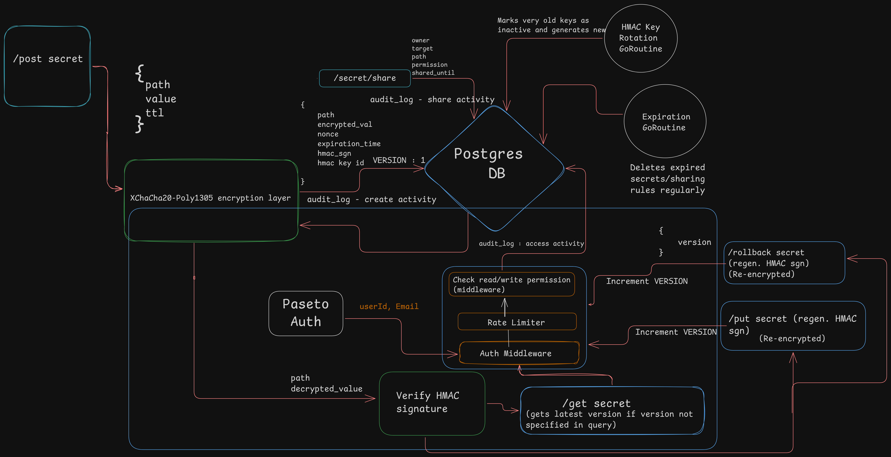

# Vaultify 🛡️

**Vaultify** is a blazing-fast, secure, and modular secrets management system written in Go. Inspired by HashiCorp Vault and designed for simplicity, security, and real-world backend experience, Vaultify helps you manage secrets safely with clean architecture, robust authentication, encryption, and audit logging.

---

## 🚀 Features

* 🔐 **PASETO-based Authentication**
* 🔒 **Secrets Encryption** with XChaCha20-Poly1305
* 📅 **Secret TTL / Expiry Support**
* 📝 **Structured Audit Logging** with Zap
* ⚙️ **Modular Architecture**
* 🐘 **PostgreSQL-backed Persistence**
* 🐳 **Dockerized Dev Environment**
* 🛠️ **Migration Support** via `migrate`
* 📄 **SQLC for Type-safe Queries**

---


## 🧱 Architecture

Vaultify is designed for secure secret management using modern cryptographic standards and clean API design. Here's how the core system flows:



### 🔐 Secret Storage Flow

* **POST `/post secret`**

  * Accepts: `{ path, value, ttl }`
  * Passes through the `XChaCha20-Poly1305` encryption layer
  * Encrypted value (`encrypted_val` + `nonce`) is saved in **Postgres**, along with `expiration_time`

### 📤 Secret Sharing

* **POST `/secret/share`**

  * Allows sharing of secrets with another user (`target`) with scoped permissions (`read` / `write`) and expiry
  * Logs all share activity (who shared what, with whom, until when)

### 🔐 Auth + Access

* **Paseto Auth** provides `userId`, `email`
* **Auth Middleware** validates token & permission for the secret’s path
* Middleware checks access control (read/write) before hitting:

  * `GET /get secret`
  * `PUT /put secret`

### 🧹 Auto Expiration

* A **GoRoutine** runs in the background to:

  * Delete expired secrets
  * Remove expired sharing rules
* Keeps the DB clean and lean with zero manual cleanup

### 📝 Logging

* All secret access and sharing activity is logged  for auditing and traceability

---


## 📁 Project Structure

```
.
├── cmd/                  # Entrypoint (main.go)
├── internal/
│   ├── api/              # HTTP handlers and routes
│   ├── auth/             # PASETO auth logic
│   ├── config/           # Configuration and env loading
│   ├── db/               # SQLC and migrations
│   ├── logger/           # Zap logger setup
│   ├── secrets/          # Core business logic for secret CRUD
│   └── util/             # Helpers & common utilities
├── Dockerfile            # (WIP) App Dockerfile
├── docker-compose.yml    # Local DB setup
├── Makefile              # Dev scripts (run, migrate, etc)
├── go.mod/go.sum         # Go deps
└── sqlc.yaml             # SQLC config
```

---

## ⚙️ Setup Instructions

### 1. Clone and configure

```bash
git clone https://github.com/yourname/vaultify.git
cd vaultify
cp app.env.example app.env  # Edit DB creds, secrets, etc
```

### 2. Run PostgreSQL

```bash
docker-compose up -d
```

### 3. Run Migrations

```bash
make migrate-up
```

### 4. Generate SQL Queries

```bash
make sqlc
```

### 5. Start the Server

```bash
make run
```

---

## 🔑 Authentication

Vaultify uses **PASETO (Platform-Agnostic Security Tokens)** instead of JWT for stronger security guarantees.

* Issued during login/signup
* Stored in HTTP-only cookies or sent via Bearer tokens
* Validated with symmetric secret

---

## 🔐 Secrets Management

* Secrets are encrypted using **XChaCha20-Poly1305** before persistence
* TTLs can be defined during secret creation (auto expiry)
* Secret sharing supported (with `shared_until` timestamp)

---

## 📝 Audit Logging

All sensitive actions are logged in structured Zap format:

```go
log.Info("Secret shared",
    zap.String("by", ownerEmail),
    zap.String("with", targetEmail),
    zap.String("secret_path", secretPath))
```

> Extendable to send logs to a file, DB, or external sinks.

---

## 🛠 Makefile Commands

| Command                | Description                    |
| ---------------------- | ------------------------------ |
| `make run`             | Run the server                 |
| `make sqlc`            | Generate SQLC code             |
| `make migrate-create`  | Create new DB migration        |
| `make migrate-up`      | Apply all migrations           |
| `make migrate-down`    | Rollback last migration        |
| `make migrate-drop`    | Drop all tables (careful!)     |
| `make migrate-version` | Show current migration version |
| `make migrate-force`   | Force set migration version    |

---

## 📌 Tech Stack

* **Go** 1.22+
* **PostgreSQL**
* **SQLC** (for type-safe DB queries)
* **Zap** (structured logging)
* **PASETO** (for auth)
* **XChaCha20-Poly1305** (for encryption)

---

## 🧠 TODO / In Progress

* [ ] Frontend UI (React/Next.js)
* [ ] Secret versioning
* [ ] OTP/2FA auth support
* [ ] Audit log persistence layer
* [ ] Metrics + Prometheus/Grafana

---

## 🤝 Contributing

PRs, issues and feedback are welcome! This is a learning-oriented project aiming to mimic real-world backend systems. Let’s build secure software together 💪

---


## 👑 Author

**Yashaswi Mishra**


---

> 🧪 Vaultify isn't prod-ready yet. It's your backend gym to master system design, auth, security, and distributed secrets handling. Lift heavy logic. Secure strong data.
